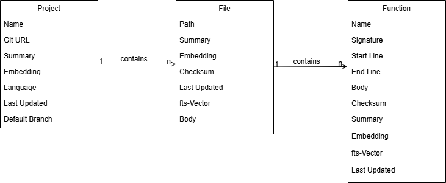

# Code Context Vault (CCV) Indexer

Code Context Vault (CCV) solves a real pain point in every engineering team: "Has anyone already solved this problem, or built something similar?"

Why it's cool:
- Semantic code search across your entire (company's) codebase — not just keyword matching, but meaning-aware hybrid search (vector + full-text) powered by embeddings. Find relevant code even if you don't know the exact function name.
- Works directly inside GitHub Copilot — exposed as an MCP server, so Copilot can automatically pull in relevant context from your indexed repositories while you code. No context-switching, no manual searching.
- Scales across multiple projects — index many repositories into a single pgVector database. Search across your whole company's codebase in one query.
- Incremental indexing — file checksums mean only changed files are re-processed on subsequent runs, keeping things fast and cheap.
- LLM-generated summaries — each file and project gets an AI-written description, making semantic search much more effective than raw code embeddings alone.
- Low friction to adopt — point it at any git repo, run register_project.py, and the next indexing run picks it up automatically.

In short: it turns your organization's collective codebase into a searchable knowledge base that your AI assistant can query in real time.


## Scope of this repo

This repo contains RAG layer used to extract the data into the database. The data can then later be queried by the code-context-vault-mcp (separate repo).

## Datamodel



## Prerequisites

- [Docker](https://docs.docker.com/get-docker/) (v20.10+)
- [Docker Compose](https://docs.docker.com/compose/install/) (v2.0+)

## Getting Started

Following tools are required:
- docker
- pgAdmin
- pgVector database

### Setup vector database

Start the container:

```bash
docker compose up -d
```

Connect to the database and enable the pgvector extension:

```bash
docker exec -it code-context-vault-db psql -U postgres -d code_context_vault
```

Then run the following SQL:

```sql
CREATE EXTENSION IF NOT EXISTS vector;
```

Verify the extension is active:

```sql
SELECT * FROM pg_extension WHERE extname = 'vector';
```

### Run database migrations

Install project dependencies and apply the latest Alembic revision:

```bash
alembic upgrade head
```

Create a new migration revision later with:

```bash
alembic revision -m "describe change"
```

### Run indexer

```bash
python src/main.py
```

### Setup env variables
- DATABASE_URL
- OPENAI_API_KEY
- OPENAI_CHAT_MODEL
- OPENAI_EMBEDDING_MODEL
